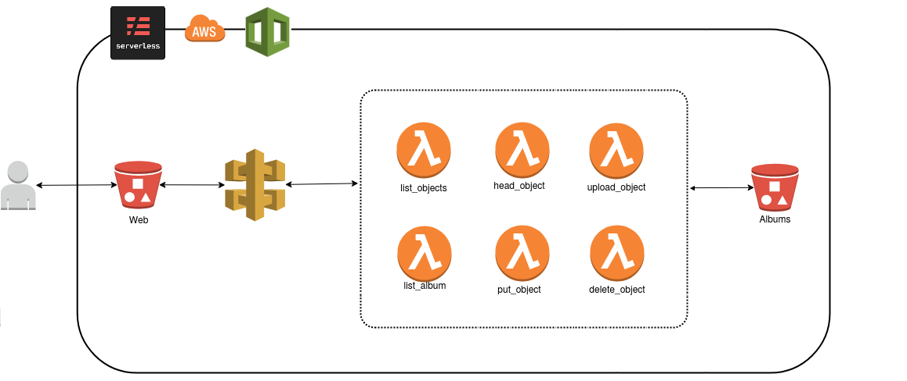

# Ejemplo Serverless 

En este repositorio se introduce la herramienta  <a href="https://serverless.com/">Serverless</a> para crear aplicaciones serverless en entornos Cloud.

Crea y despliega en AWS una aplicación web para subir fotos usando servicios autoadministrados de AWS sin necesidad de tener servidores arrancados que alojen la aplicación.

Los scripts de despliegue y borrado de la aplicación están preparados para ejecutarse en una shell bash de Linux.



## Ejecución

### Requisitos Previos

* Aplicación Serverless
* Plugins 
* Cuenta de AWS
* Key y Secret de usuario de AWS para acceso programático a la cuenta

#### Instalación de Serverless y los plugins

En <a href="https://serverless.com/framework/docs/providers/aws/guide/installation0/">este enlace</a> tienes las instrucciones para la instalación de serverless.

Posteriormente es necesaria la instalación de los plugins <a href="https://serverless.com/framework/docs/providers/aws/cli-reference/plugin-install/">de este modo.</a>

Los plugins a instalar son:

* serverless-plugin-resource-tagging
* serverless-apigw-binary
* serverless-s3-remover
* serverless-s3-sync

### Despliegue

#### Clonar y acceder al repositorio

```
git clone https://github.com/rgplaza/serverless_app.git
cd serverless_app
```

#### Exporta tus credenciales de AWS para serverless

```
export AWS_ACCESS_KEY_ID=tu_access_key
export AWS_SECRET_ACCESS_KEY=tu_secret_access_key
```

#### Despliega la aplicación Serverless

La aplicación se despliega con este comando.

```
> bash ./utils/deploy.sh
```

El script admite como parámetro el entorno a deslegar p.e. **prod**, **test** , por defecto será **dev**.

Esto desplegará la aplicación en entorno indicado y te indicará la URL en la que se ha desplegado la web para poder acceder a ella y subir tus fotos.


#### Elimina la aplicación Serverless

##### Importante

Al borrar la aplicación se elimina el cubo **album**, si quieres conservar las imágenes subidas descárgatelas o haz una copia en otro cubo.

La aplicación se elimina con este comando.

```
> bash ./utils/remove.sh
```
Por defecto elimina el entorno **dev**, al igual que el despliegue admite como parámetro el entorno a eliminar p.e. **prod**, **test** 


